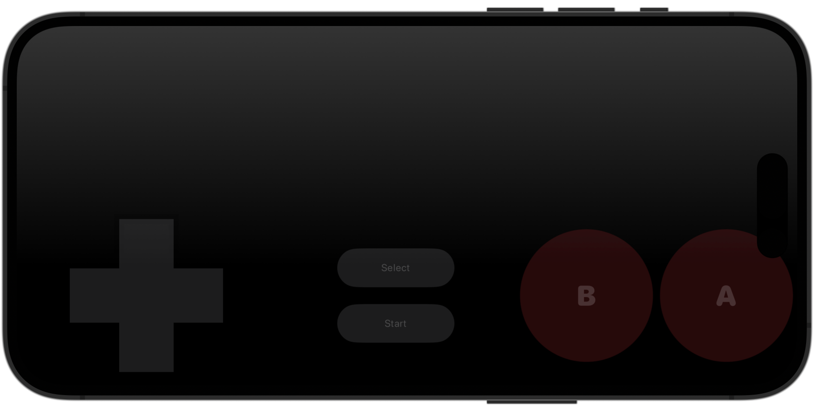

# OnscreenController
SwiftUI virtual game controller for iOS

`OnscreenController` provides a “virtual” game controller that can be included in iOS and iPadOS apps that use SwiftUI. It produces a `View` with a similar button layout to that of the Nintendo Entertainment System (NES). It takes a collection of callbacks, one for each button on the controller, called when that button starts or stops being pressed. 

It is primarly written using SwiftUI but uses some UIKit internally for gesture recognition. It requires a minimum of Xcode 14 and iOS 16 or iPadOS 16.

`OnscreenController` is used in Blackbox, a forthcoming open source Swift NES emulator, but is available under MIT license for use in other projects.

The branch `feature/addVisionOSSupport` adds visionOS support, though this has only been minimally tested.



## Why use it when [`GCVirtualController`](https://developer.apple.com/documentation/gamecontroller/gcvirtualcontroller) exists?
I built `OnscreenController` for use in Blackbox because I found `GCVirtualController` unsatisfactory. When attempting to use it in a SwiftUI app, I could not get it to lay out in a functional way in some configurations: in particular, iPhones in portrait mode. I also had trouble with `GCVirtualController` not responding correctly to device orientation changes and not layering correctly when using a custom `Scene`. This was on Xcode 14/the iOS 16 SDK; subsequent releases of the OS/SDK/Xcode may mitigate these issues.

## Usage 

One way the `OnscreenController` component can be configured and used in a SwiftUI view is like this:
    
``` Swift
enum Button {
    case up, down, left, right, select, start, b, a
}

struct MyView: View {
    @State private var pressedButtons: Set<Button> = []

    var body: some View {
        OnscreenController(
            up: { set(.up, $0) },
            down: { set(.down, $0) },
            left: { set(.left, $0) },
            right: { set(.right, $0) },
            select: { set(.select, $0) },
            start: { set(.start, $0) },
            b: { set(.b, $0) },
            a: { set(.a, $0) }
        )
        .onChange(of: pressedButtons) {
            // Function (body not shown here) that takes a `Set<Button>` representing the pressed buttons each time that set changes.
            onscreenButtonsPressed($0) 
        }
    }

    private func set(_ button: Button, _ isOn: Bool) {
        if isOn {
            pressedButtons.insert(button)
        } else {
            pressedButtons.remove(button)
        }
    }
}
```

Note that you’ll likely want to use `OnscreenController` in an `overlay` or `ZStack` that covers more area than is used by the component to show its buttons. That way, `OnscreenController` can provide a better user experience by tracking touches that start outside of its visually-apparent region but go on to intersect with its buttons. This provides a significantly better experience for the player.  

## What needs work
`OnscreenController` is a project to learn more about some SwiftUI features including anchor preferences, interfacing with UIKit, and drawing (`Path`s and `Shape`s). I’d be very happy to receive feedback on it, so suggestions, contributions, and PRs are welcomed.

Here are a few features that might be added in the future:
- Make buttons highlight when pressed, providing visual feedback
- Haptic feedback
- Visual customization by consumers
- Layout improvements
  - Revise for aesthetics and player performance
  - Enable different button configurations
  - Tune on various devices, including improved avoidance of the camera array and Dynamic Island 
- Drop UIKit dependency
  - As of iOS 16, I don’t believe `OnscreenController`’s behavior would be possible without some UIKit usage, but that’s likely to change as SwiftUI continues to evolve.
- The code that draws the DPad is particularly crude, and the `Path` it provides shows some minor visual issues in some circumstances.
